## 前言

大家好，我是**陌溪**

最近我在**Gitee**逛**开源项目**的时候，发现很多**做的不错的开源项目**都拥有自己的**开源文档**。

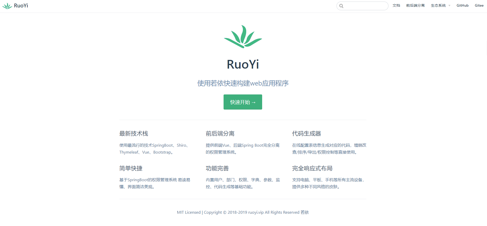

一份好的开源文档，能够方便大家快速进行内容的检索，让小伙伴在**项目搭建的时候少走弯路**。

后面陌溪就开始琢磨着，给**蘑菇博客**也编写一个开源文档。将一些**项目搭建的文档**都放在上面，这样即使自己的网站宕机了，小伙伴也可以**通过查看开源文档完成蘑菇博客的部署(**因为蘑菇博客好几次宕机了，导致小伙伴无法正常完成项目部署)

陌溪经过全方位的调查，发现别人开源项目的文档主要是通过 **docsify** 和 **vuepress** 进行编写

> vuepress官网：https://www.vuepress.cn/
>
> docsify官网：https://docsify.js.org/#/

**RuoYi** 项目用的是 **Vuepress**，效果如上图所示。后面我发现 **docsify** 搭建出来的样式比 **Vuepress** 的好看一些，所以就选择使用 **docsify** 进行搭建。没办法，谁叫我是**颜值控**呢

最终蘑菇博客的开源文档效果如下所示：


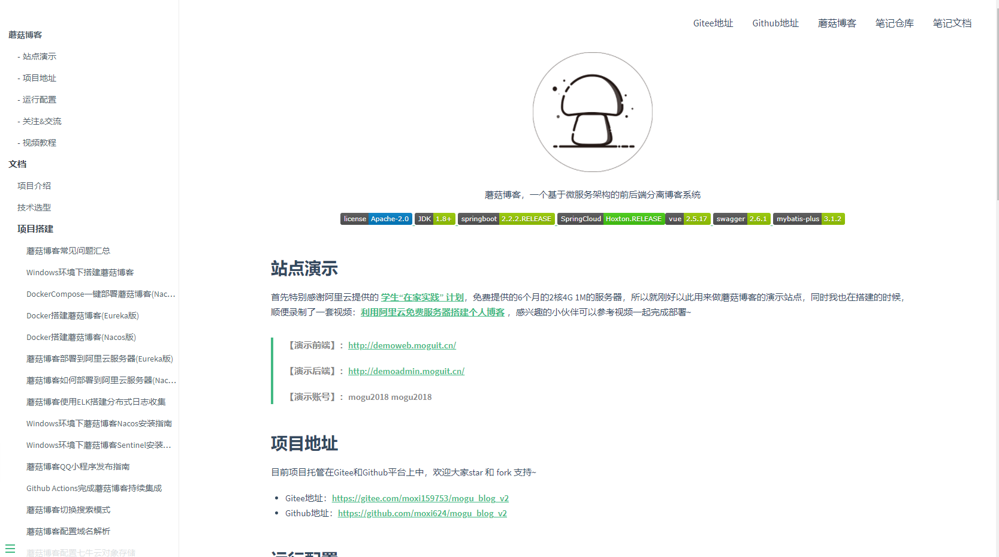

> 文档地址：[http://doc.moguit.cn](http://doc.moguit.cn/)

下面，我将会介绍我是如何完成文档的搭建过程

## 安装

首先需要安装 **docsify-cli** 脚手架，用于初始化 **docsify** 文档项目

```bash
npm i docsify-cli -g
```

然后初始化

```bash
docsify init ./docs
```

初始化后，我们就能看到 docs文件夹，里面含有下面内容


目录结构如下所示

- **index.html** ：入口文件
- **README.md**：会做为主页内容渲染
- **.nojekyll**：用于阻止 GitHub Pages 会忽略掉下划线开头的文件 (.后缀结尾的是隐藏文件)

## 启动

在我们使用 **init** 命令初始化一个文档后，我们需要通过下面命令**运行一个本地服务器**

```bash
docsify serve
```

项目启动后，默认访问 [http://localhost:3000](http://localhost:3000/) ，如下图所示，我们能够看到一个帮助文档的骨架了


同时 **docsify** 还提供了 **LiveReload** 功能，也就是可以在我们修改文档后，能够**实时预览**

## 修改Loading

初始化时会显示 **Loading...** 内容，你可以自定义提示信息，我们只需要修改 **index.html** 中的 `<div id='app'>`标签即可，在里面加入我们需要的提示内容

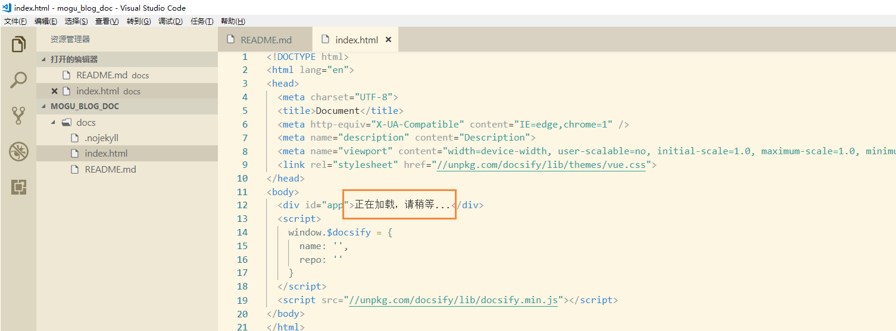

### 定制侧边栏

默认情况下，侧边栏会根据当前文档的标题生成目录，也可以通过设置文档链接，通过Markdown文件生成，效果如当前的文件的侧边栏，首先我们在 **index.html** 里面进行设置

```
window.$docsify = {
	loadSidebar: true, // 设置侧边栏
}
```

然后新增一个markdown文件`_sidebar.md` , 下面就是我的侧边栏代码，其实是使用了超链接，每个目录都链接到我的目录下的markdown文件。

```markdown
- [**蘑菇博客**](README.md)

- **文档**

  - [项目介绍](doc/文档/项目介绍.md)
  - [技术选型](doc/文档/技术选型.md)
  - 项目搭建
    - [Windows环境下搭建蘑菇博客](doc/文档/项目搭建/Windows环境下搭建蘑菇博客/README.md)
    - [Docker搭建蘑菇博客](doc/文档/项目搭建/Docker搭建蘑菇博客/README.md)
    - [蘑菇博客部署到云服务器](doc/文档/项目搭建/蘑菇博客部署到云服务器/README.md)
    - [Github Actions完成蘑菇博客持续集成](doc/文档/项目搭建/蘑菇博客使用GithubAction完成持续集成/README.md)
    - [蘑菇博客切换搜索模式](doc/文档/项目搭建/蘑菇博客切换搜索模式/README.md)
    - [蘑菇博客配置七牛云对象存储](doc/文档/项目搭建/蘑菇博客配置七牛云存储/README.md)
    - [使用Zipkin搭建蘑菇博客链路追踪](doc/文档/项目搭建/使用Zipkin搭建蘑菇博客链路追踪/README.md)

- **其他**

  - [致谢](doc/文档/致谢.md)
  - [将要做的事](doc/文档/将要做的事.md)
  - [贡献代码](doc/文档/贡献代码.md)
```

效果图如下所示：

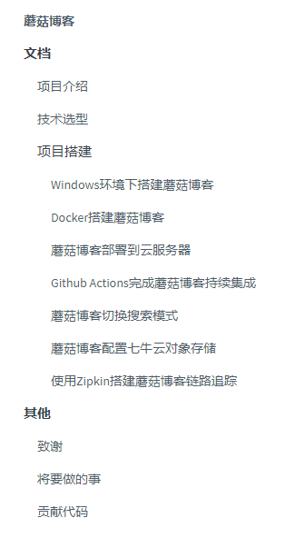

## 显示页面目录

定制的侧边栏仅显示了页面的链接。还可以设置在侧边栏显示当前页面的目录(标题)。需要在 `index.html` 文件中的 `window.$docsify` 添加 `subMaxLevel` 字段来设置：

```bash
window.$docsify = {
    loadSidebar: true,
    subMaxLevel: 3
}
```

通过 `subMaxLevel` 来限制显示的标题等级，效果如下所示：

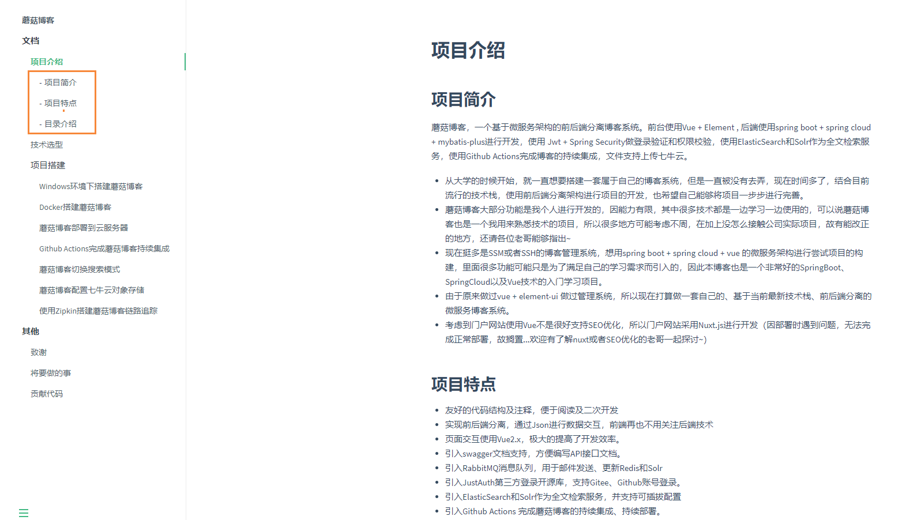

**subMaxLevel** 类型是 **number**(数字)，表示显示的目录层级 

**注意：**如果md文件中的第一个标题是一级标题，那么不会显示在侧边栏，如上图所示

| 值   | 说明                                           |
| ---- | ---------------------------------------------- |
| 0    | 默认值，表示不显示目录                         |
| 1    | 显示一级标题(`h1`)                             |
| 2    | 显示一、二级标题(`h1` ~ `h2`)                  |
| 3    | 显示一、二、三级标题(`h1` ~ `h3`)              |
| n    | n是数字，显示一、二、....n 级标题(`h1` ~ `hn`) |

## 定制导航栏

首先需要在`index.html`文件中的`window.$docsify`添加`loadNavbar: true,`选项：

```bash
window.$docsify = {
	loadNavbar: true
}
```

接着在项目根目录创建 `_navbar.md` 文件，内容格式如下：

```markdown
- [Gitee](https://gitee.com/moxi159753/mogu_blog_v2)
- [Github](https://github.com/moxi624/mogu_blog_v2)
- [演示](http://moguit.cn/#/)
```

**注意**

- 如果使用配置文件来设置导航栏，那么在`index.html`中定义的导航栏只有在定制的首页才会生效，其他页面会被覆盖。
- 如果只在根目录有一个`_navbar.md`文件，那么所有页面都将使用这个一个配置，也就是所有页面的导航栏都一样。
- 如果一个子目录中有`_navbar.md`文件，那么这个子目录下的所有页面将使用这个文件的导航栏。
- `_navbar.md`的加载逻辑是从每层目录下获取文件，如果当前目录不存在该文件则回退到上一级目录。例如当前路径为`/zh-cn/more-pages`则从`/zh-cn/_navbar.md`获取文件，如果不存在则从`/_navbar.md`获取。

## 设置封面

docsify默认是没有封面的，默认有个首页`./README.md`。 通过设置`coverpage`参数，可以开启渲染封面的功能。首先需要在`index.html`文件中的`window.$docsify`添加`coverpage: true`选项：

```bash
window.$docsify = {
	coverpage: true
}
```

接着在项目根目录创建`_coverpage.md`文件，内容格式如下：

```markdown


# 蘑菇博客

- 蘑菇博客，一个基于微服务架构的前后端分离博客系统。前台使用Vue + Element , 后端使用spring boot + spring cloud + mybatis-plus进行开发，使用 Jwt + Spring Security做登录验证和权限校验，使用ElasticSearch和Solr作为全文检索服务，使用Github Actions完成博客的持续集成，文件支持上传七牛云。

[](https://gitee.com/moxi159753/mogu_blog_v2/stargazers)
[](https://gitee.com/moxi159753/mogu_blog_v2/members)

[Gitee](<https://gitee.com/moxi159753/mogu_blog_v2>)
[Github](<https://github.com/moxi624/mogu_blog_v2>)
[开始阅读](README.md)
```

效果图如下所示：


在这里使用了两个 **Gitee** 挂件，可以在开源项目的挂件按钮那里获取

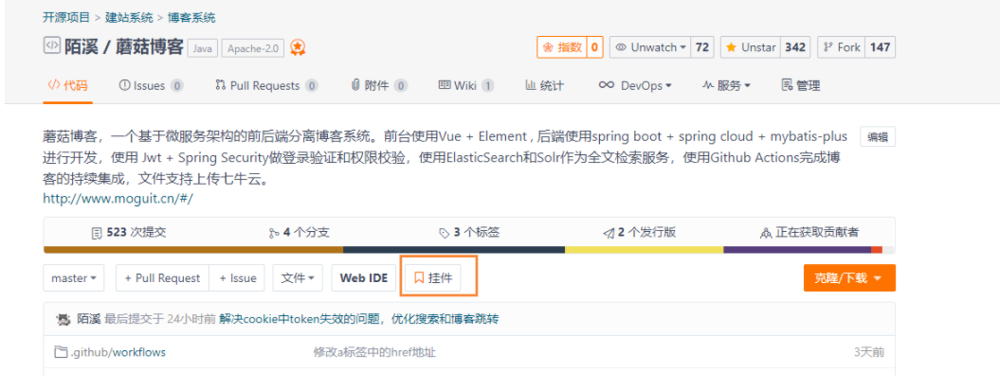

**注意：**一份文档只会在根目录下加载封面，其他页面或者二级目录下都不会加载。

## 自定义封面背景

目前的背景是随机生成的渐变色，每次刷新都会显示不同的颜色。 docsify封面支持自定义背景色或者背景图，在`_coverpage.md`文档末尾添加：

```bash
<!-- 背景图片 -->


<!-- 背景色 -->

```

**注意：**

- 自定义背景配置一定要在`_coverpage.md`文档末尾。
- 背景图片和背景色只能有一个生效.
- 背景色一定要是`#2f4253`这种格式的。

## 封面作为首页

配置了封面后，封面和首页是同时出现的，封面在上面，首页在下面。通过设置`onlyCover`参数，可以让docsify网站首页只显示封面，原来的首页通过`http://localhost:3000/#/README`访问。在`index.html`文件中的`window.$docsify`添加`onlyCover: true,`选项：

```bash
window.$docsify = {
    coverpage: true,
    onlyCover: true,
}
```

通过此配置可以把`./README.md`文件独立出来，当成项目真正的README介绍文件

### 搜索插件

全文搜索插件会根据当前页面上的超链接获取文档内容，在 localStorage 内建立文档索引。默认过期时间为一天，当然我们可以自己指定需要缓存的文件列表或者配置过期时间。

```html
<script>
    window.$docsify = {
      // 完整配置参数
      search: {
        maxAge: 86400000,               // 过期时间，单位毫秒，默认一天
        paths: [],                      // or 'auto'，匹配文件路径
        placeholder: 'Type to search',  // 搜索提示框文字， 支持本地化，例子在下面
        // placeholder: {
        //   '/zh-cn/': '搜索',
        //   '/': 'Type to search'
        // },
        noData: 'No Results!',          // 找不到结果文字提示，支持本地化，例子在下面
        // noData: {
        //   '/zh-cn/': '找不到结果',
        //   '/': 'No Results'
        // },
        depth: 2,                       // 搜索标题的最大程级, 1 - 6
      }
    }
  </script>
  <!-- 引入搜索模块 -->
  <script src="//unpkg.com/docsify/lib/plugins/search.js"></script>
```

安装后，我们就能够使用搜索功能了

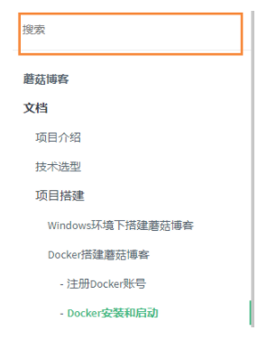

## 自定义域名

首先我们需要创建项目 `moxi624.github.io` ，第一个moxi624是你的用户名，然后我们在创建一个文件 `CNAME`

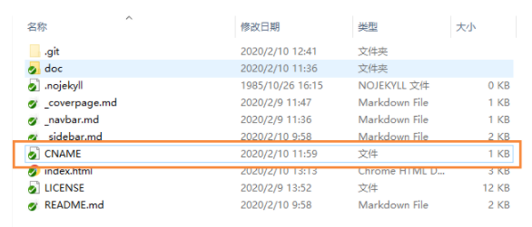

里面添加我们需要自定义的域名

```bash
doc.moguit.cn
```

然后把当前项目提交到 **moxi624.github.io** 远程项目，然后选择 **settings**

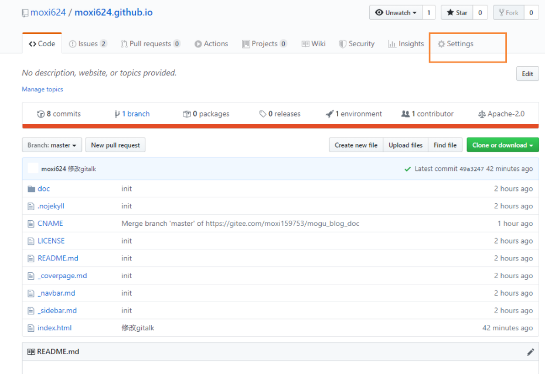

然后找到 **Github Pages**，选择主分支 **master**

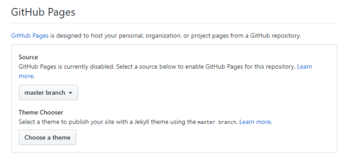

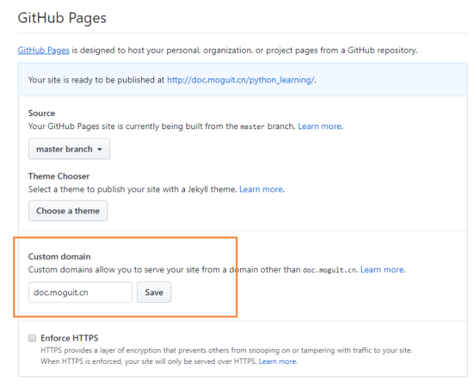

完成后，我们能够看到这样的页面，说明我们的站点已经发布在 **doc.moguit.cn** 了

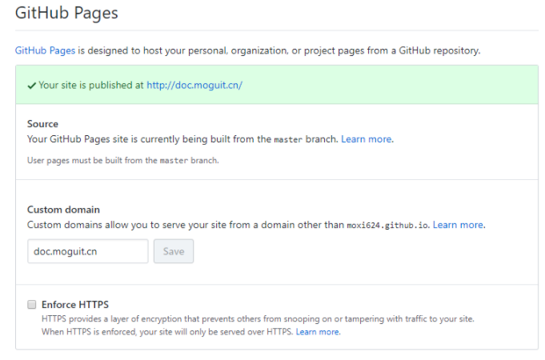

这个时候就需要配置域名解析了，我们到阿里云下的域名解析

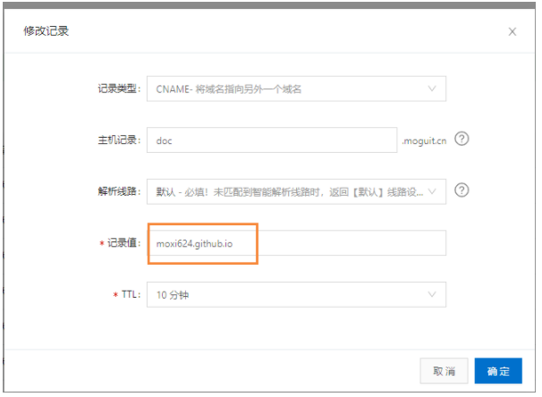

注意，这边 **moxi624.github.io** 就是我们刚刚创建的仓库名

创建完成后，我们等待十分钟后，就能够正常访问我们的页面了~

## 评论插件Gitalk

**Gitalk**：一个现代化的，基于 **Preact** 和 **Github issue** 的评论系统。**Gitalk** 的特性如下：

- 使用 **GitHub** 登录 
- 支持多语言 **[en, zh-CN, zh-TW, es-ES, fr, ru]** 
- 支持个人或组织 
- 无干扰模式（设置 **distractionFreeMode** 为 **true** 开启） 
- 快捷键提交评论 （**cmd**|**ctrl + enter**）

使用例子：

```bash
<!-- 引入 gitalk留言功能 -->
<link rel="stylesheet" href="//unpkg.com/gitalk/dist/gitalk.css">
<script src="//unpkg.com/gitalk/dist/gitalk.min.js"></script>
<script src="//unpkg.com/docsify/lib/plugins/gitalk.min.js"></script>
<script>
  const gitalk = new Gitalk({
    clientID: 'XXXXXXXXXXXXXXXXXXXX',
    clientSecret: 'XXXXXXXXXXXXXXXX',
    repo: 'XXXXXXXXXXXXXX', // 存放评论的仓库
    owner: 'XXXXX', // 仓库的创建者
    admin: ['XXXXX'], // 如果仓库有多个人可以操作，那么在这里以数组形式写出
    id: location.pathname, // 用于标记评论是哪个页面的
  })
</script>
```

其中我们首先需要到 **Github Settings** 中，创建一个 **New OAuth App**


然后添加如下内容

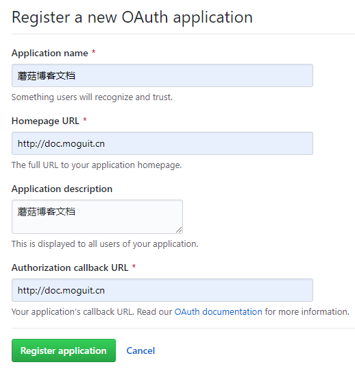

创建完成后，在复制我们的密钥，替换上面的 **clientID** 和 **clientSecret**

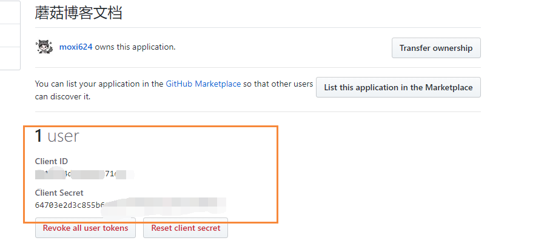

最终，在页面引入 **Gittalk** 的效果图

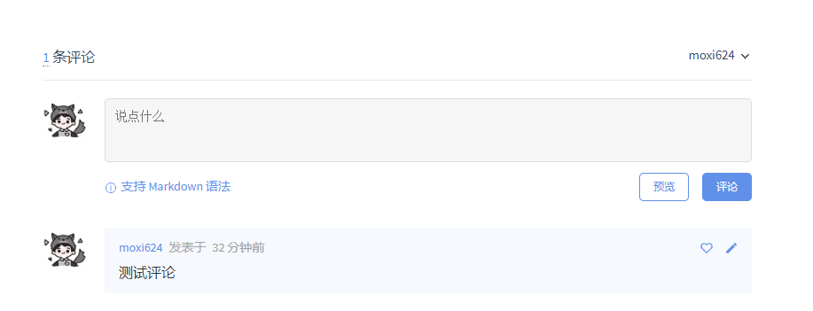

到此为止，蘑菇博客的开源文档就已经完成了，后续只需要不断加入文章完善即可。

